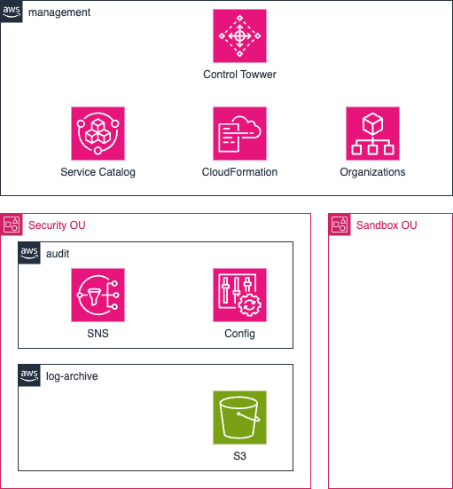

# aws-controltower-cdk

A CDK repository for setting up and managing AWS Control Tower environment

- [aws-controltower-cdk](#aws-controltower-cdk)
  - [Architecture](#architecture)
  - [Prereqquisites](#prereqquisites)
  - [How to Deploy](#how-to-deploy)
    - [1. Checkout a repository](#1-checkout-a-repository)
    - [2. Initializing a projects](#2-initializing-a-projects)
      - [2.1 (If use a Docker)](#21-if-use-a-docker)
      - [2.2 Install Node.s libraries](#22-install-nodes-libraries)
    - [3. Deploy a landingzone](#3-deploy-a-landingzone)
      - [3.1 Create an environment file](#31-create-an-environment-file)
      - [3.2 Set deployment parameters](#32-set-deployment-parameters)
      - [3.3 Deployment](#33-deployment)

## Architecture



## Prereqquisites

It uses the following runtimes. Please follow the instructions for each OS to install.

- [Docker Engine](https://docs.docker.com/engine/install/)
- [Git](https://git-scm.com/)
- [AWS CLI](https://docs.aws.amazon.com/cli/latest/userguide/cli-chap-getting-started.html)

If you don't want to use a container environment, please install the following components individually.

- [Node.js](https://nodejs.org)
- [AWS CDK](https://docs.aws.amazon.com/cdk/v2/guide/getting_started.html)

## How to Deploy

### 1. Checkout a repository

```bash
git clone https://github.com/pphos/aws-controltower-cdk.git
cd aws-controltower-cdk
```

### 2. Initializing a projects

#### 2.1 (If use a Docker)

If you are using a Docker environment, please execute the following command to start Docker.

```bash
docker compose up -d
docker compose exec cdk bash
```

#### 2.2 Install Node.s libraries

```bash
ct infra/ct-landing-zone
npm install
```

### 3. Deploy a landingzone

#### 3.1 Create an environment file

Configure the email addresses in the `.env` file that will be used for the Security account and Logging account in AWS Control Tower.

```bash
CT_SECURITY_ACCOUNT_EMAIL="username+audit@example.com"
CT_LOGGING_ACCOUNT_EMAIL="username+log-archive@example.com"
```

#### 3.2 Set deployment parameters

You must specify paramters specific to each use case, such as gorverned region.
The parameters are specified here.

```bash
infra/ct-landing-zone/parameter.ts
```

This example defines a parameter set called prodParameter.

```typescript
export const prodParameter: AppParameter = {
  envName: "Prod",
  ctVersion: "3.3",
  ctGovernedRegions: ["ap-northeast-1", "us-east-1"],
  ctEnableCentlizedLogging: true,
};
```

The details of this setting are as follows.
| key | value |
| -- | -- |
| envName| Environment name |
| ctVersion | The landing zone's current deployed version |
| ctGovernedRegions | List of regions you want to manage under the AWS Control Tower|
| ctEnableCentlizedLogging | If you want to set AWS CloudTrail trails, please set this flag to `true` otherwise `false`|

#### 3.3 Deployment

If you are running the CDK application for the first time, please execute the following command

```bash
cdk bootstrap
```

※ If the deployment fails, please confirm that your AWS access key credentials are configured correctly.

Deploy a landingzone

```bash
cdk deploy
```

※ It will take about 30 to 60 minutes.
